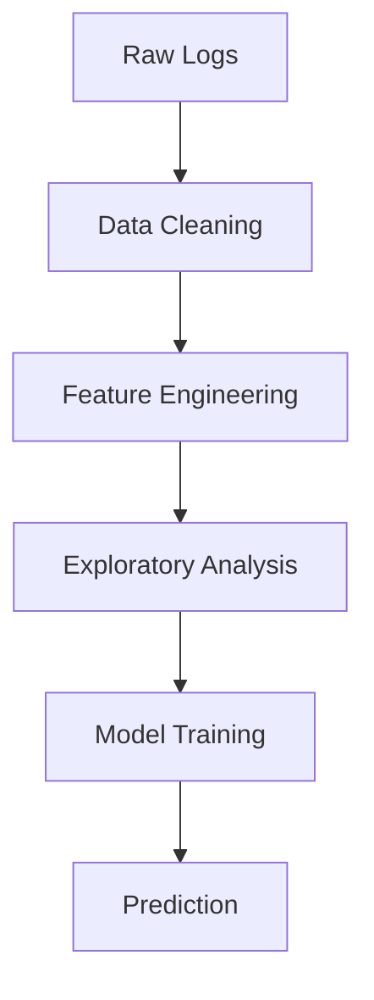

# E-Commerce User Behavior Analytics System

## 🚀 Project Overview
This analytics system processes e-commerce website logs to:
- Identify user behavior patterns
- Visualize key sales trends
- Predict high-value customers using machine learning
- Provide actionable business insights

## ✨ Key Features
- **Data Processing Pipeline**:
  - Missing value imputation
  - Feature engineering
  - Categorical encoding
- **Advanced Analytics**:
  - User segmentation
  - Session analysis
  - Sales trend visualization
- **ML Prediction**:
  - High-spender classification (85% accuracy)
  - Feature importance analysis

## 📊 Dataset Description
The dataset (`E-commerce Website Logs.csv`) contains:

| Feature | Description | Type |
|---------|-------------|------|
| `duration_(secs)` | Session duration | Numerical |
| `sales` | Transaction amount | Numerical |
| `country` | User location | Categorical |
| `age` | User age | Numerical |
| `pay_method` | Payment type | Categorical |

**Size**: 10,000+ records with 15+ features

## 💻 Technical Implementation

### Data Flow

## Results

